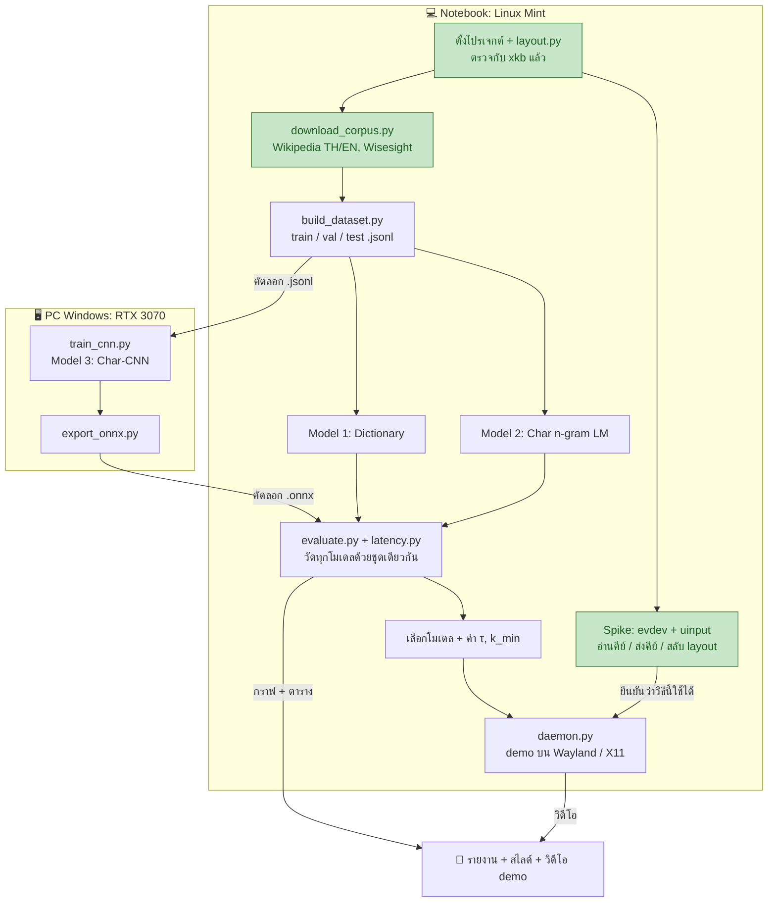
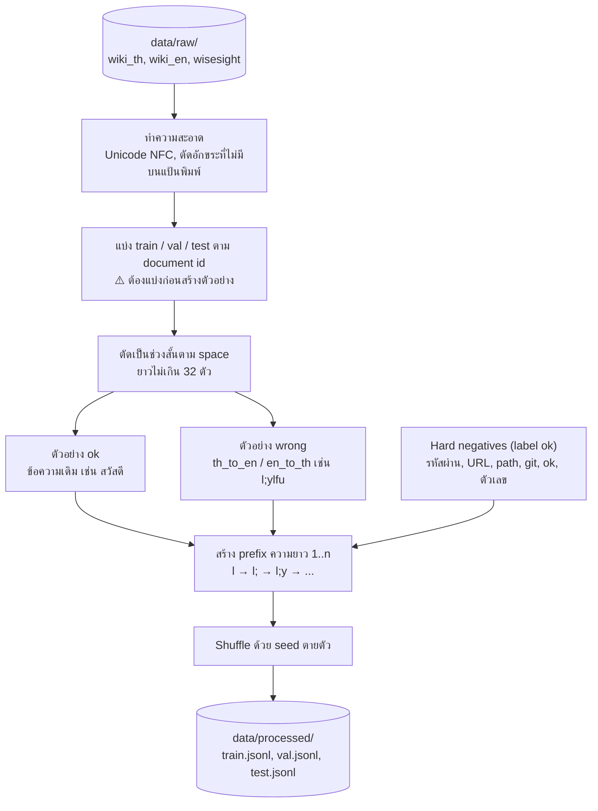
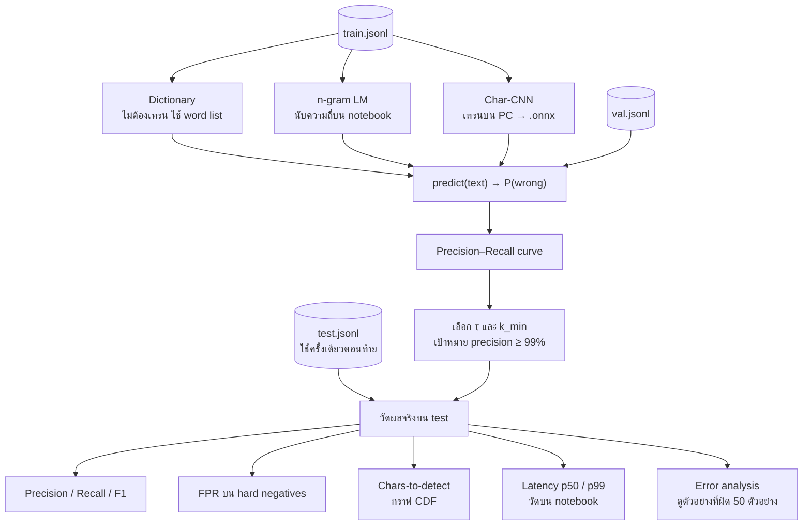
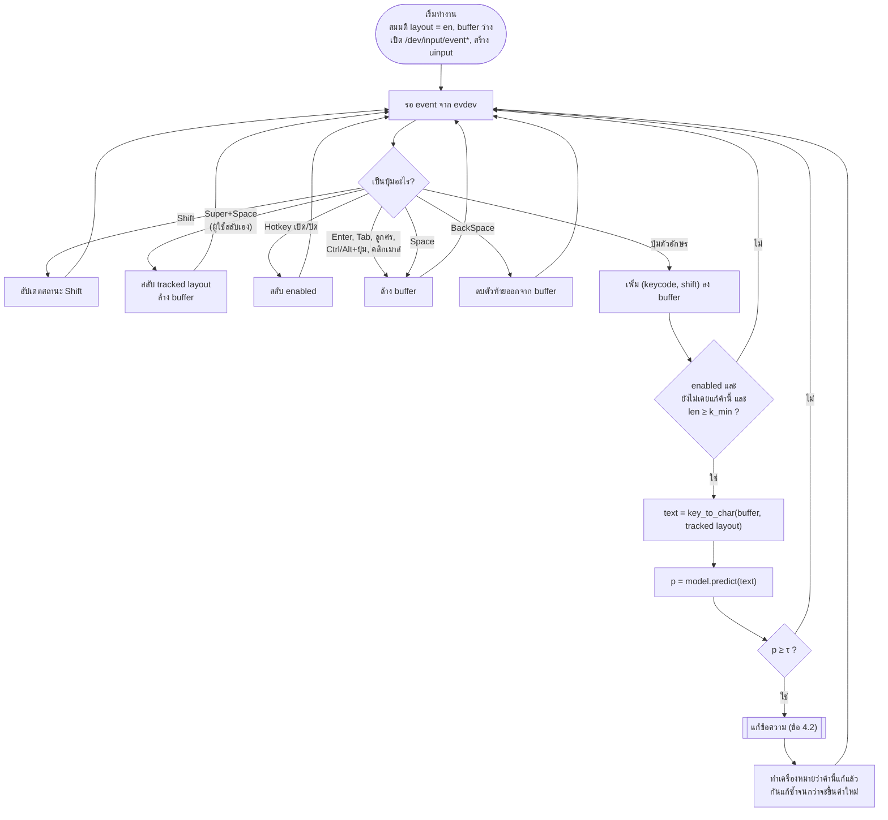
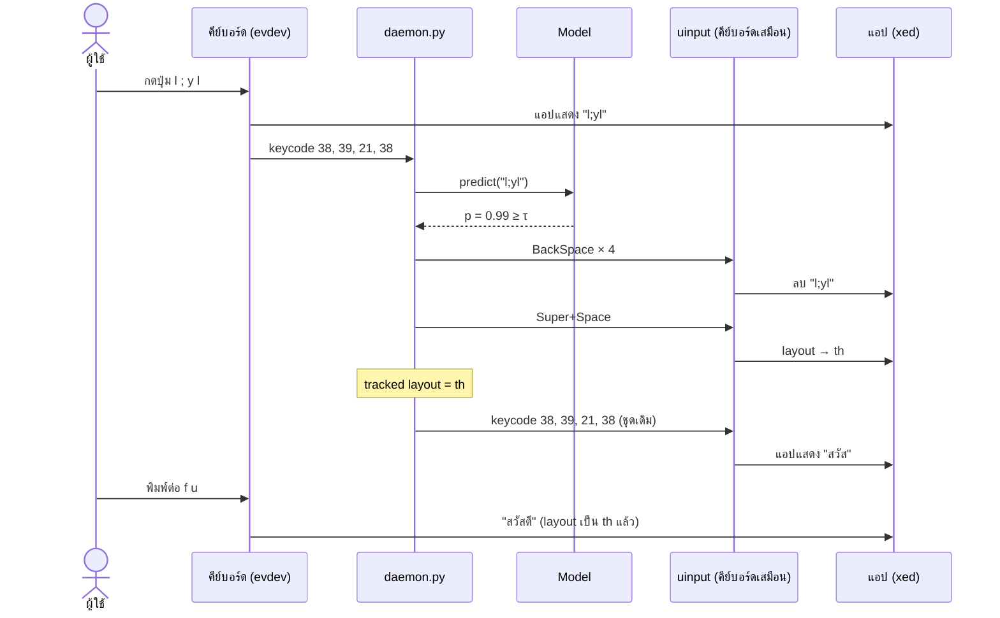

# Flow กระบวนการทำงาน

แผนรายวันอยู่ที่ [IMPLEMENTATION_PLAN.md](IMPLEMENTATION_PLAN.md) และเหตุผลของงานที่ทำแล้วอยู่ที่ [WORKLOG.md](WORKLOG.md)

> ดู diagram ใน VS Code: ติดตั้ง extension "Markdown Preview Mermaid Support" แล้วกด `Ctrl+Shift+V` (บน GitHub แสดงผลได้ทันที)

---

## 1. ภาพรวมทั้งโปรเจกต์

ลำดับงานตั้งแต่เริ่มจนส่ง แยกตามเครื่องที่ใช้ทำ สีเขียวคือเสร็จแล้ว



**จุดที่ต้องระวัง**
- `build_dataset.py` เป็นทางผ่านของทุกอย่าง ถ้าทำช้า งานส่วนอื่นจะช้าตามทั้งหมด จึงอยู่ในวันที่ 2
- ส่วน PC กับ notebook ทำพร้อมกันได้: ระหว่างที่ CNN เทรนบน PC ให้ทำ n-gram และ `evaluate.py` บน notebook
- ทุกโมเดลต้องเข้า `evaluate.py` ผ่าน interface เดียวกัน `predict(text) -> float` ผลจึงเทียบกันได้อย่างยุติธรรม

---

## 2. การสร้าง Dataset (`build_dataset.py`)



**ทำไมต้องแบ่ง train/test ก่อนสร้างตัวอย่าง:** ประโยคเดียวกันจะกลายเป็นหลายตัวอย่าง (ok, wrong และ prefix ทุกความยาว) ถ้าสร้างตัวอย่างก่อนแล้วค่อยสุ่มแบ่ง ตัวอย่างจากประโยคเดียวกันจะไปอยู่ทั้งใน train และ test ผล test จะดีเกินจริง (data leakage)

**ตัวอย่าง 1 บรรทัดในไฟล์ output**
```json
{"text": "l;ylfu", "active": "en", "label": "wrong", "intended": "สวัสดี", "source": "wisesight", "kind": "normal"}
```

---

## 3. การเทรนและวัดผล



**ทำไมต้องแยก val กับ test:** ใช้ val เลือกค่า τ ถ้าใช้ test เลือก τ แล้ววัดผลบน test ซ้ำ ก็เหมือนดูข้อสอบก่อนสอบ ตัวเลขจะดีเกินจริง

---

## 4. การทำงานของ Daemon ตอนใช้งานจริง (`daemon.py`)

### 4.1 เมื่อได้รับ event 1 ครั้ง



**จุดที่ต้องระวัง**
- **ทำเครื่องหมายว่าแก้แล้ว:** หลังแก้ ผู้ใช้จะพิมพ์คำเดิมต่อ ถ้าไม่ทำเครื่องหมาย daemon อาจตัดสินซ้ำแล้วสลับกลับ
- **คลิกเมาส์ต้องล้าง buffer:** ผู้ใช้อาจย้ายเคอร์เซอร์ไปที่อื่นแล้ว ถ้าส่ง BackSpace ตอนนั้นจะลบข้อความผิดที่
- **ไม่อ่าน event จากอุปกรณ์ uinput ของตัวเอง:** ไม่อย่างนั้นคีย์ที่ส่งออกไปจะวนกลับมาเป็น input อีกรอบ

### 4.2 ขั้นตอนแก้ข้อความ

ตัวอย่าง: ผู้ใช้ตั้งใจพิมพ์ "สวัสดี" แต่ layout เป็น en



**ข้อดีของวิธีนี้:** หลังสลับ layout แล้วส่ง keycode **ชุดเดิม** กลับไปได้เลย ไม่ต้องแปลงตัวอักษร ระบบแปลงให้เองตาม layout ใหม่ และผู้ใช้พิมพ์ต่อได้ทันทีเพราะ layout ถูกแล้ว

---

## 5. สถานะปัจจุบัน

| ขั้นตอน | สถานะ |
|---|---|
| ตั้งโปรเจกต์ + `layout.py` + tests | ✅ |
| `download_corpus.py` | ✅ |
| Spike evdev/uinput บน X11 | ✅ |
| Spike บน Wayland | ⏳ ต้อง logout แล้ว login เข้า session Wayland |
| `build_dataset.py` | ⬜ งานถัดไป |
| Models, evaluation, daemon, รายงาน | ⬜ |
