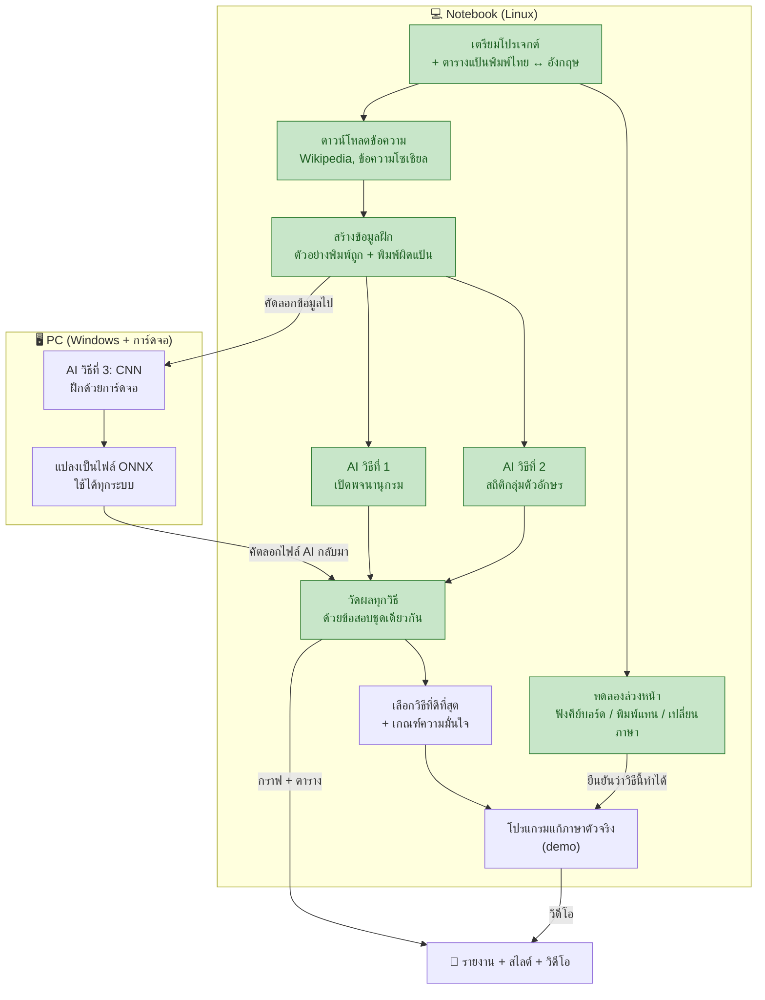
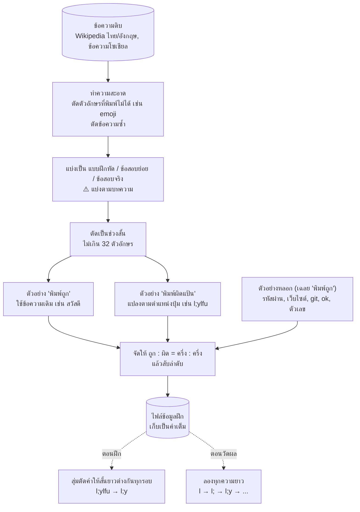
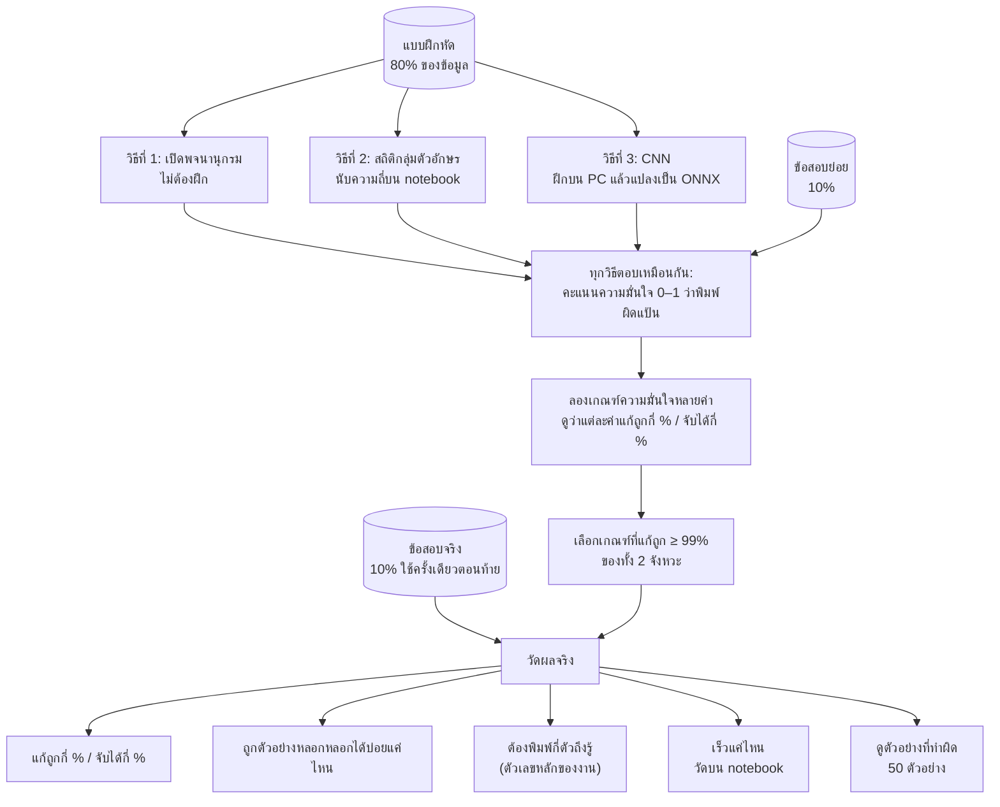
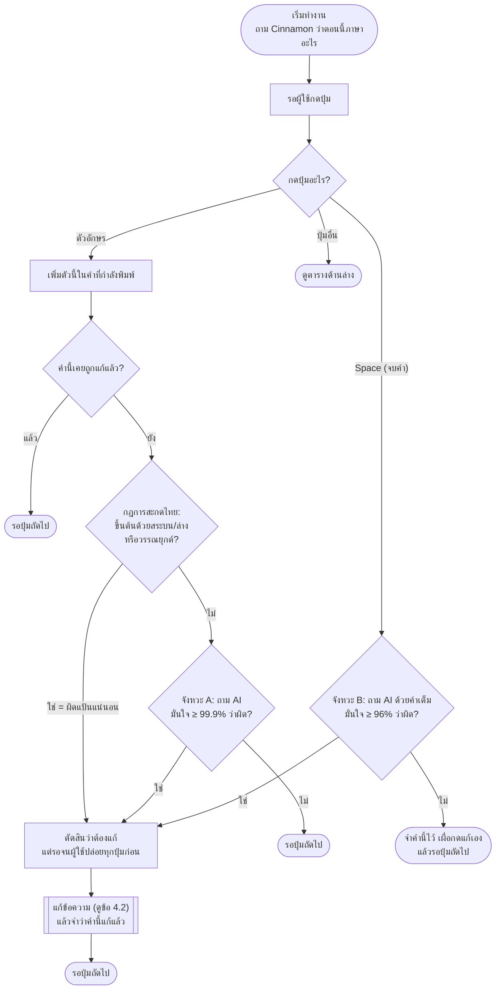
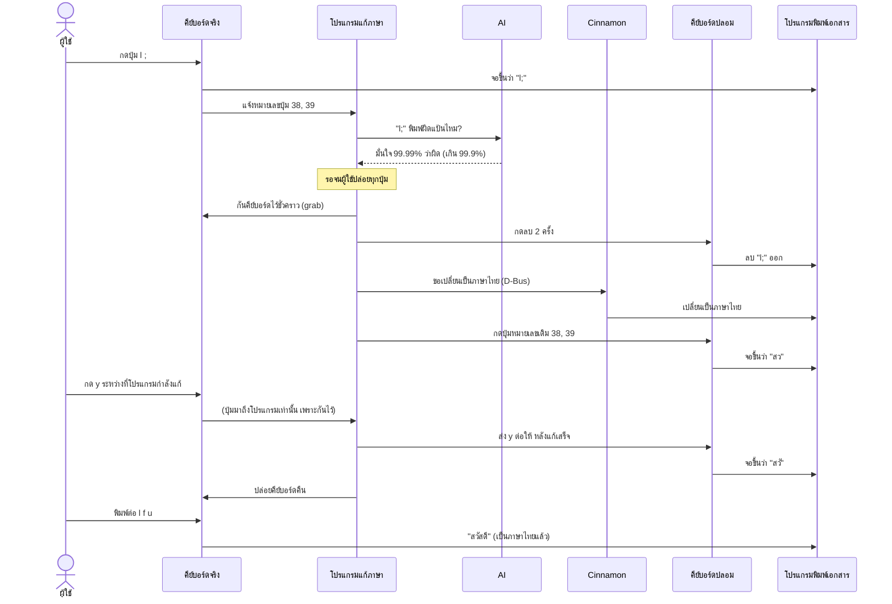

# แผนภาพการทำงาน

เอกสารนี้ใช้แผนภาพอธิบายว่าโปรเจกต์ทำงานอย่างไร มีทั้งหมด 4 ภาพ เรียงจากภาพกว้างไปหาภาพละเอียด

1. **ภาพรวมโปรเจกต์:** ทำอะไรก่อนหลัง บนเครื่องไหน
2. **การเตรียมข้อมูลฝึก:** เปลี่ยนบทความธรรมดาเป็นตัวอย่างสำหรับสอน AI
3. **การฝึกและวัดผล AI**
4. **การทำงานของโปรแกรมแก้ภาษา:** เกิดอะไรขึ้นทุกครั้งที่กดปุ่ม

ถ้าเจอคำที่ไม่รู้จัก ดูได้ที่ [อภิธานศัพท์](GLOSSARY.md) ส่วนตารางวันทำงานอยู่ที่ [แผนการทำงาน](IMPLEMENTATION_PLAN.md) และสิ่งที่ทำไปแล้วอยู่ที่ [WORKLOG.md](WORKLOG.md)

> **วิธีดูแผนภาพ:** บน GitHub แผนภาพจะแสดงเองทันที ส่วนใน VS Code ให้ติดตั้ง extension "Markdown Preview Mermaid Support" แล้วกด `Ctrl+Shift+V`

---

## 1. ภาพรวมโปรเจกต์

ภาพนี้แสดงลำดับงานทั้งหมดตั้งแต่เริ่มจนส่ง แบ่งตามเครื่องที่ใช้ทำ **กล่องสีเขียวคืองานที่เสร็จแล้ว**



**อ่านภาพนี้อย่างไร**
- **"สร้างข้อมูลฝึก" คือคอขวด** งานเกือบทุกอย่างต้องรอขั้นนี้ จึงต้องทำให้เสร็จเร็วที่สุด
- **ทำ 2 เครื่องพร้อมกันได้** ระหว่างที่ PC ฝึก CNN อยู่ notebook ก็ทำวิธีที่ 1–2 และโปรแกรมวัดผลไปด้วย
- **ทุกวิธีสอบด้วยข้อสอบชุดเดียวกัน** การเปรียบเทียบจึงยุติธรรม

---

## 2. การเตรียมข้อมูลฝึก

AI ต้องเรียนจากตัวอย่างที่มีเฉลย ภาพนี้แสดงว่าเปลี่ยนบทความธรรมดาเป็นตัวอย่างพร้อมเฉลยได้อย่างไร **โดยไม่ต้องใช้คนเขียนเฉลยเลย**



**คำอธิบายแต่ละขั้น**

| ขั้น | ทำอะไร | ทำไม |
|---|---|---|
| ทำความสะอาด | ตัดสิ่งที่พิมพ์จากคีย์บอร์ดไม่ได้ และตัดข้อความซ้ำ | AI ควรเห็นเฉพาะสิ่งที่คนพิมพ์ได้จริง |
| **แบ่งตามบทความ** | ประโยคจากบทความเดียวกันอยู่ส่วนเดียวกันเสมอ | ถ้าแบ่งมั่ว ประโยคที่คล้ายกันจะไปอยู่ทั้งในแบบฝึกหัดและข้อสอบ **เหมือนข้อสอบรั่ว** คะแนนจะสูงเกินจริง |
| ตัดเป็นช่วงสั้น | ยาวไม่เกิน 32 ตัว | เท่ากับที่คนพิมพ์ในแต่ละคำ |
| สร้างตัวอย่าง 2 แบบ | แบบเดิม = ถูก, แบบแปลงแป้น = ผิด | ได้เฉลยฟรี เพราะรู้อยู่แล้วว่าแปลงมาอย่างไร |
| **ตัวอย่างหลอก** | สิ่งที่พิมพ์ถูกแต่ดูแปลก | สอนให้ AI รู้ว่า "แปลกไม่ได้แปลว่าผิด" ไม่อย่างนั้น AI อาจไปแปลงรหัสผ่านของผู้ใช้ |
| ครึ่งต่อครึ่ง | ตัวอย่างถูกกับผิดมีจำนวนเท่ากัน | AI จะไม่เอียงไปตอบข้างใดข้างหนึ่ง |
| **เก็บเป็นคำเต็ม** | ตอนฝึกค่อยสุ่มตัดให้สั้นลง | ไฟล์เล็กลงหลายเท่า และแต่ละรอบ AI ได้เห็นตัวอย่างไม่ซ้ำเดิม |

**ตัวอย่าง 1 รายการในไฟล์ข้อมูลฝึก**
```json
{"text": "l;ylfu", "active": "en", "label": "wrong", "intended": "สวัสดี", "source": "wisesight", "kind": "normal"}
```
อ่านว่า: ข้อความ `l;ylfu` พิมพ์ตอนเครื่องตั้งเป็นอังกฤษ (`active: en`) เฉลยคือพิมพ์ผิดแป้น (`label: wrong`) ผู้ใช้ตั้งใจพิมพ์ว่า "สวัสดี" มาจากข้อความโซเชียล และเป็นตัวอย่างปกติ ไม่ใช่ตัวอย่างหลอก

---

## 3. การฝึกและวัดผล AI

ภาพนี้แสดงว่า AI แต่ละวิธีเรียนจากอะไร และวัดผลอย่างไร เปรียบเหมือนนักเรียน 3 คนที่ทำแบบฝึกหัดชุดเดียวกัน ทำข้อสอบย่อยเพื่อปรับวิธี แล้วสอบข้อสอบจริงชุดเดียวกัน



**ทำไมต้องแยกข้อสอบย่อยกับข้อสอบจริง:** ใช้ข้อสอบย่อยเลือกเกณฑ์ความมั่นใจ ถ้าใช้ข้อสอบจริงเลือกเกณฑ์ แล้ววัดผลด้วยข้อสอบจริงชุดเดิมอีก ก็เหมือน**ดูข้อสอบก่อนสอบ** คะแนนจะดีเกินจริง ข้อสอบจริงจึงใช้แค่ครั้งเดียวตอนท้าย

**ทำไมเน้น "แก้ถูกกี่ %":** ถ้าโปรแกรมไปแก้ทั้งที่ผู้ใช้พิมพ์ถูก เช่น เปลี่ยน `git` เป็น `เระ` จะน่ารำคาญกว่าไม่มีโปรแกรมเลย จึงต้องให้แก้ถูกอย่างน้อย 99% แม้จะทำให้จับพลาดไปบ้าง

---

## 4. การทำงานของโปรแกรมแก้ภาษา

### 4.1 ทุกครั้งที่กดปุ่ม

ภาพนี้แสดงเส้นทางหลัก คือเมื่อผู้ใช้กดตัวอักษรหรือ Space ส่วนปุ่มอื่นๆ อยู่ในตารางใต้ภาพ



**ปุ่มอื่นๆ**

| ปุ่ม / เหตุการณ์ | โปรแกรมทำอะไร | ทำไม |
|---|---|---|
| Shift | จำว่ากด Shift อยู่ | ปุ่มเดียวกันให้ตัวอักษรต่างกันเมื่อกด Shift |
| Super+Space, Super+Alt+1/2 หรือ Cinnamon แจ้งว่าภาษาเปลี่ยน | จำภาษาใหม่ แล้วเริ่มคำใหม่ | ภาษาที่จำไว้ต้องตรงกับเครื่องเสมอ Cinnamon แจ้งได้แม้ผู้ใช้คลิกเปลี่ยนบนแถบงาน |
| Super+Alt+F | แปลงคำปัจจุบันหรือคำล่าสุด โดยไม่ถาม AI (กดซ้ำ = ยกเลิก) | ทางสำรองเมื่อ AI ไม่แก้ให้ หรือแก้ผิด |
| Super+Alt+P | หยุด / ทำต่อ การแก้อัตโนมัติ | เช่น ตอนพิมพ์รหัสผ่าน |
| ลบ (BackSpace) | ลบตัวท้ายออกจากคำที่จำไว้ และยกเลิกการแก้ที่รออยู่ | ผู้ใช้กำลังแก้เอง |
| Enter, Tab | ลืมคำปัจจุบัน และถือว่าตัวต่อไปเป็นต้นคำ | ขึ้นบรรทัดหรือช่องใหม่ |
| ลูกศร, ปุ่มลัดอื่น, คลิกเมาส์ | ลืมคำปัจจุบัน | เคอร์เซอร์อาจย้ายไปแล้ว ถ้ากดลบจะลบผิดที่ |

<details>
<summary>กฎการสะกดไทยหลังคลิกเมาส์</summary>

หลังคลิก โปรแกรมไม่รู้ว่าเคอร์เซอร์อยู่ต้นคำ หรือต่อท้ายพยัญชนะกลางคำ (ซึ่งพิมพ์สระต่อได้ถูกต้อง) จึงใช้กฎที่เข้มขึ้น คือต้องมีสระหรือวรรณยุกต์ต่างกัน 3 ตัวติดกัน เช่น `the` → `ะ้ำ` ภาษาไทยจริงแทบไม่มีแบบนี้ (WORKLOG ข้อ 18)

</details>

**ตรวจ 2 จังหวะ ด้วย AI ตัวเดียวกัน**

| จังหวะ | ตรวจเมื่อไร | ต้องมั่นใจแค่ไหน | ข้อดี |
|---|---|---|---|
| **A. ระหว่างพิมพ์** | ทุกครั้งที่กดตัวอักษร | มากๆ (99.9%) | แก้เร็ว ผู้ใช้ต้องลบน้อย |
| **B. ตอนจบคำ** | ตอนกด space | น้อยลงได้ (96%) | เห็นทั้งคำแล้วจึงแม่นกว่า ใช้เก็บกรณีที่จังหวะ A ไม่กล้าแก้ |
| **ปุ่มแก้เอง** | ผู้ใช้กดเอง | ไม่ต้องถาม AI | ทางสำรองเมื่อ AI ไม่แก้ให้ |

**จุดที่ต้องระวัง (เจอระหว่างออกแบบ)**
- **จังหวะ B ต้องลบ space ด้วย:** โปรแกรมแค่ "ฟัง" ไม่ได้ "ขวาง" การกดปุ่ม space จึงขึ้นบนจอไปแล้ว ตอนแก้ต้องลบเพิ่มอีก 1 ตัว แล้วพิมพ์ space คืนหลังพิมพ์คำใหม่
- **ต้องจำว่าคำนี้แก้แล้ว:** หลังแก้ ผู้ใช้จะพิมพ์คำเดิมต่อ ถ้าไม่จำไว้ โปรแกรมอาจตัดสินซ้ำแล้วเปลี่ยนภาษากลับ
- **คลิกเมาส์ต้องลืมคำปัจจุบัน:** เคอร์เซอร์อาจย้ายไปที่อื่นแล้ว ถ้ากดลบตอนนั้นจะลบข้อความผิดที่
- **ต้องรอให้ผู้ใช้ปล่อยทุกปุ่มก่อนแก้:** ถ้าแก้ขณะที่นิ้วยังกดปุ่มค้าง ปุ่มนั้นจะพิมพ์ซ้ำไม่ได้ (เคยได้ `lheo` แทน `hello`)
- **ต้องไม่ฟังคีย์บอร์ดปลอมของตัวเอง:** ไม่อย่างนั้นสิ่งที่โปรแกรมพิมพ์ออกไปจะวนกลับมาเป็นสิ่งที่ "ผู้ใช้พิมพ์" อีกรอบ

### 4.2 ขั้นตอนแก้ข้อความ

ตัวอย่าง: ผู้ใช้ตั้งใจพิมพ์ "สวัสดี" แต่เครื่องตั้งเป็นภาษาอังกฤษ ภาพนี้อ่านจากบนลงล่างตามลำดับเวลา



**จุดที่ทำให้ง่าย:** หลังเปลี่ยนภาษาแล้ว โปรแกรมแค่**กดปุ่มเดิมซ้ำ** ระบบก็แปลงเป็นภาษาไทยให้เอง ไม่ต้องคำนวณว่าต้องพิมพ์ตัวอะไร และผู้ใช้พิมพ์ต่อได้ทันทีเพราะเครื่องเปลี่ยนเป็นภาษาที่ถูกแล้ว

**จุดที่ต้องระวัง:** ระหว่างแก้ (ประมาณ 0.2 วินาที) ผู้ใช้อาจพิมพ์ต่อ โปรแกรมจึง**กันคีย์บอร์ดไว้ชั่วคราว** แล้วส่งปุ่มที่ผู้ใช้กดระหว่างนั้นต่อให้หลังแก้เสร็จ ตัวอักษรจึงไม่แทรกผิดที่

---

## 5. ตอนนี้อยู่ตรงไหน

| ขั้นตอน | สถานะ |
|---|---|
| เตรียมโปรเจกต์ + ตารางแป้นพิมพ์ + โปรแกรมตรวจความถูกต้อง | ✅ เสร็จ |
| ดาวน์โหลดข้อความ | ✅ เสร็จ |
| ทดลองล่วงหน้าบน X11 และ Wayland | ✅ เสร็จ |
| สร้างข้อมูลฝึก | ✅ เสร็จ (1.49 ล้านตัวอย่าง) |
| AI ทั้ง 4 วิธี + โปรแกรมวัดผล | ✅ เสร็จ |
| โปรแกรมแก้ภาษา (ทดสอบใน xed, เว็บเบราว์เซอร์, terminal แล้ว) | ✅ เสร็จ |
| รายงาน, สไลด์, วิดีโอ | ⏳ กำลังทำ |
