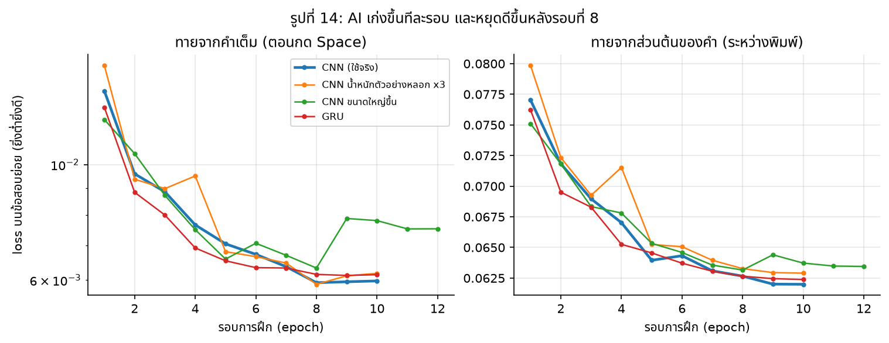
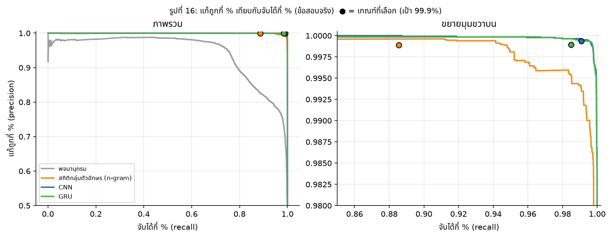
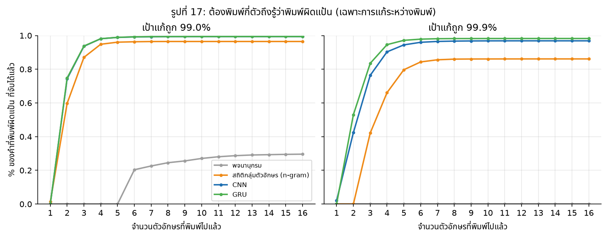
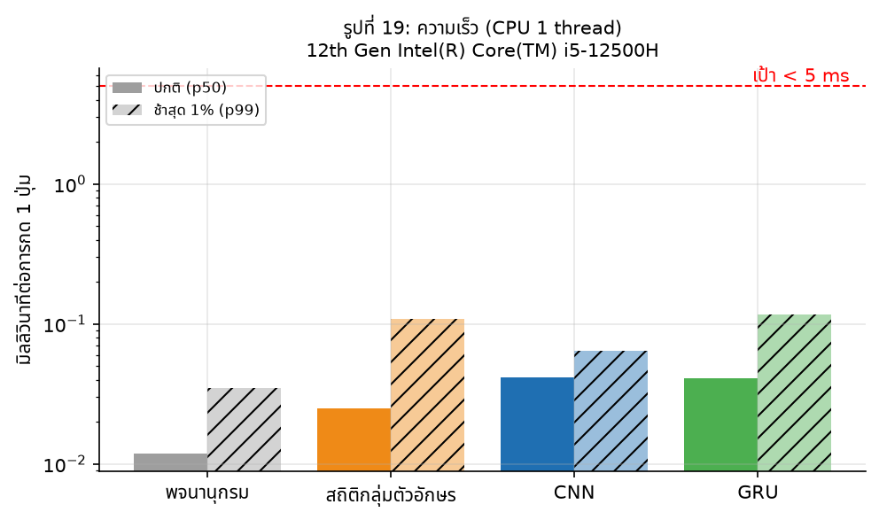
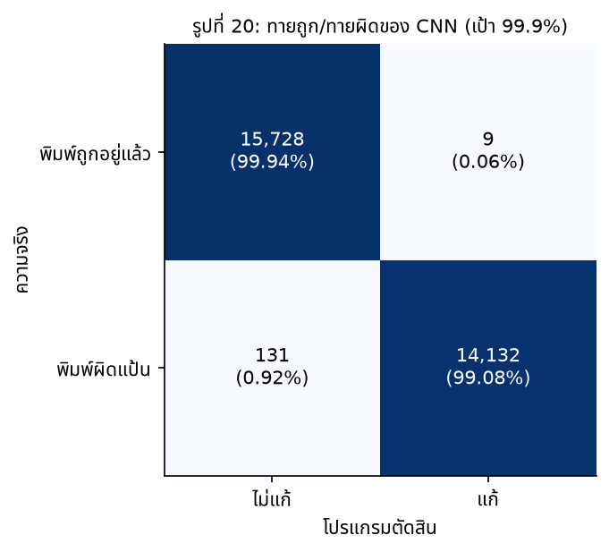

# ลืมเปลี่ยนภาษา: ระบบตรวจจับและแก้ข้อความที่พิมพ์ผิดแป้น (ไทย ↔ อังกฤษ) บน Linux ด้วย Machine Learning

> **ร่างรายงาน** (4 ต.ค. 2026) ส่วนที่มีเครื่องหมาย ⬜ TODO คือส่วนที่รอผลหรือรอรูป ดูรายการทั้งหมดได้ที่ท้ายไฟล์

| | |
|---|---|
| **ผู้จัดทำ** | ⬜ TODO ชื่อ-นามสกุล (รหัสนักศึกษา 6710110151) |
| **รายวิชา** | ⬜ TODO ชื่อและรหัสวิชา |
| **อาจารย์ผู้สอน** | ⬜ TODO |
| **สถาบัน** | ภาควิชาวิศวกรรมคอมพิวเตอร์ มหาวิทยาลัยสงขลานครินทร์ |
| **โค้ด** | https://github.com/Mhapong/LuemPreanParSar |

---

## บทคัดย่อ

ผู้ใช้ที่พิมพ์ทั้งภาษาไทยและอังกฤษมักลืมเปลี่ยนภาษาของแป้นพิมพ์ เช่น ตั้งใจพิมพ์ "สวัสดี" แต่ได้ `l;ylfu` บน Windows และ macOS มีโปรแกรมแก้ให้อัตโนมัติ แต่บน Linux แทบไม่มี โดยเฉพาะบนระบบหน้าจอ Wayland ที่ห้ามโปรแกรมดักการพิมพ์ของกัน โครงงานนี้นิยามปัญหาเป็นการจำแนกสองกลุ่ม (binary classification) ระดับตัวอักษร ว่า "ข้อความที่อยู่บนจอ ผู้ใช้ตั้งใจพิมพ์ด้วยภาษาที่ตั้งอยู่จริงหรือไม่" และสร้างข้อมูลฝึกพร้อมเฉลยได้เองโดยอัตโนมัติ จากการแปลงข้อความจริงผ่านตารางตำแหน่งปุ่ม ได้ข้อมูล 1.49 ล้านตัวอย่างจาก Wikipedia ไทย/อังกฤษ และข้อความโซเชียล (Wisesight) พร้อม "ตัวอย่างหลอก" เช่น รหัสผ่านและคำสั่งคอมพิวเตอร์ แล้วเปรียบเทียบ 4 วิธี ได้แก่ พจนานุกรม, character n-gram language model, char-CNN และ GRU โดยวัดผลแบบเดียวกับการใช้งานจริง คือตรวจทั้งระหว่างพิมพ์และตอนจบคำ เลือกเกณฑ์จากข้อมูลตรวจสอบ (validation) แล้ววัดบนข้อมูลทดสอบ (test) ครั้งเดียว ที่เกณฑ์แก้ถูกอย่างน้อย 99.9% CNN จับข้อความที่พิมพ์ผิดแป้นได้ 99.1% แก้ผิดกับข้อความปกติเพียง 0.06% ส่วนใหญ่รู้ได้ภายใน 3 ตัวอักษร และใช้เวลา 0.04 ms ต่อการกดปุ่มบน CPU ของ notebook ขณะที่ n-gram จับได้ 88.6% และวิธีพจนานุกรมไม่ถึงเป้าความแม่น ส่วนระบบบน Linux ใช้การอ่านคีย์จาก kernel (evdev) และพิมพ์แทนผ่านคีย์บอร์ดเสมือน (uinput) ซึ่งทดสอบแล้วว่าใช้ได้ทั้งบน X11 และ Wayland

**คำสำคัญ:** keyboard layout, language identification, character-level model, CNN, noisy channel, Wayland

---

## 1. บทนำ

### 1.1 ที่มาและความสำคัญของปัญหา

คนไทยที่ใช้คอมพิวเตอร์ต้องสลับระหว่างแป้นภาษาไทย (เกษมณี) กับภาษาอังกฤษ (QWERTY) ตลอดเวลา และมักลืมสลับ ผลคือได้ข้อความที่อ่านไม่ออก ต้องลบ กดเปลี่ยนภาษา แล้วพิมพ์ใหม่

| ตั้งใจพิมพ์ | เครื่องตั้งเป็น | หน้าจอขึ้นว่า |
|---|---|---|
| สวัสดีครับ | อังกฤษ | `l;ylfu8iy[` |
| hello | ไทย | `้ำสสน` |

⬜ TODO รูปที่ 1: ภาพหน้าจอตัวอย่างการพิมพ์ผิดแป้นจริง (FIGURES.md รูป 2)

บน Windows และ macOS มีโปรแกรมแก้ให้อัตโนมัติ แต่บน Linux แทบไม่มี และระบบหน้าจอรุ่นใหม่ของ Linux คือ Wayland (ค่าเริ่มต้นของ Ubuntu รุ่นปัจจุบัน) ไม่อนุญาตให้โปรแกรมหนึ่งดักการพิมพ์ของอีกโปรแกรม ทำให้วิธีแบบเดิมใช้ไม่ได้

### 1.2 วัตถุประสงค์

1. สร้างข้อมูลฝึกสำหรับปัญหานี้แบบอัตโนมัติ โดยไม่ต้องให้คนเขียนเฉลย
2. เปรียบเทียบวิธีตรวจจับตั้งแต่แบบง่ายไปจนถึง neural network
3. วัดผลในแบบที่สะท้อนการใช้งานจริง ได้แก่ ความแม่นเมื่อแก้, ต้องพิมพ์กี่ตัวถึงรู้ และความเร็ว
4. สร้างระบบต้นแบบที่ทำงานจริงบน Linux ทั้ง X11 และ Wayland

### 1.3 ขอบเขต

- แป้นภาษาไทยแบบเกษมณี ↔ แป้นอังกฤษแบบ US QWERTY
- Linux Mint 22.3 (Cinnamon) ทั้ง X11 และ Wayland
- ไม่รวม: แป้นแบบอื่น (เช่น ปัตตะโชติ), ข้อความที่พิมพ์สองภาษาปนในคำเดียว และการทำเป็นส่วนเสริมของโปรแกรมช่วยพิมพ์ (IBus/Fcitx5)

---

## 2. งานที่เกี่ยวข้อง

⬜ TODO ตรวจสอบรายละเอียดและใส่อ้างอิงของแต่ละงานก่อนส่ง

- **โปรแกรมสลับภาษาอัตโนมัติ** เช่น Punto Switcher (Windows, รัสเซีย ↔ อังกฤษ), RightLang และ X Neural Switcher (xneur, Linux X11) ส่วนใหญ่ใช้กฎหรือพจนานุกรม และโปรแกรมบน Linux ที่มีอยู่ทำงานบน X11 เท่านั้น
- **การระบุภาษา (language identification)** เช่น langid.py [5] และ fastText [6] ใช้ character n-gram ระบุภาษาของข้อความ แต่ไม่ได้ออกแบบสำหรับกรณีนี้ เพราะ `l;ylfu` เขียนด้วยอักษรละติน แต่จริงๆ แล้วเป็นภาษาไทย
- **การแก้คำผิดด้วย noisy channel model** [4] มองว่าข้อความถูกบิดเบือนระหว่างทาง แล้วหาข้อความต้นฉบับที่น่าจะเป็นที่สุด งานนี้ใช้กรอบเดียวกัน โดยช่องสัญญาณคือการลืมสลับแป้น
- **CNN และ RNN ระดับตัวอักษร** สำหรับจำแนกข้อความ [2], [3], [7]

---

## 3. การนิยามปัญหา

### 3.1 คำถามเดียวที่ต้องตอบ

ตัวอักษรที่ขึ้นบนจอบอกอยู่แล้วว่าเครื่องตั้งภาษาอะไร (อักษรไทยแปลว่าตั้งเป็นไทย) งานนี้จึงเหลือคำถามเดียว คือ **ผู้ใช้ตั้งใจพิมพ์ด้วยภาษาที่ตั้งอยู่จริงหรือไม่** ซึ่งเป็น binary classification

| บนจอ | ภาษาที่ตั้งอยู่ | ตั้งใจพิมพ์ | เฉลย |
|---|---|---|---|
| `สวัสดี` | ไทย | ไทย | ok |
| `hello` | อังกฤษ | อังกฤษ | ok |
| `l;ylfu` | อังกฤษ | ไทย | wrong |
| `้ำสสน` | ไทย | อังกฤษ | wrong |

โมเดลทุกตัวรับข้อความบนจอ (ไม่เกิน 32 ตัวอักษร นับจากเว้นวรรคล่าสุด) แล้วตอบความน่าจะเป็น P(wrong | ข้อความ)

### 3.2 มองเป็น noisy channel

```
ข้อความที่ตั้งใจ  ──►  [ลืมสลับแป้น: กดปุ่มเดิมแต่คนละภาษา]  ──►  ข้อความบนจอ
   "สวัสดี"                                                   "l;ylfu"
```

ช่องสัญญาณนี้เป็นแบบกำหนดแน่นอน (deterministic) เพราะปุ่มหนึ่งให้ตัวอักษรเดียวในแต่ละภาษา จึงแปลงกลับได้เสมอ ส่วนที่ยากคือการตัดสินว่า "แบบไหนเป็นภาษาจริงมากกว่า"

### 3.3 ตรวจ 2 จังหวะ

| จังหวะ | ตรวจเมื่อไร | สิ่งที่โมเดลเห็น | แก้เมื่อ |
|---|---|---|---|
| A. ระหว่างพิมพ์ | ทุกครั้งที่กดตัวอักษร หลังพิมพ์ไปอย่างน้อย k_min ตัว | ส่วนต้นของคำ (prefix) เช่น `l;y` | P ≥ τ_type |
| B. ตอนจบคำ | ตอนกด Space ถ้าจังหวะ A ยังไม่ได้แก้ | ทั้งคำ เช่น `l;ylfu` | P ≥ τ_space |

จังหวะ A แก้ได้เร็ว ผู้ใช้ลบน้อย ส่วนจังหวะ B เห็นทั้งคำจึงแม่นกว่า ใช้เก็บกรณีที่ A ไม่มั่นใจพอ ค่า k_min, τ_type และ τ_space เลือกจากข้อมูลตรวจสอบ (หัวข้อ 5.3)

---

## 4. ข้อมูล

### 4.1 สร้างเฉลยได้เองโดยไม่ต้องใช้คน

เนื่องจากรู้ว่าแต่ละปุ่มพิมพ์ตัวอะไรในแต่ละภาษา จึงแปลงข้อความจริงเป็นตัวอย่าง "พิมพ์ผิดแป้น" ได้ทันที ตารางแป้นพิมพ์ทั้ง 94 ปุ่ม (รวม Shift) ตรวจกับไฟล์กำหนดแป้นของระบบ (`/usr/share/X11/xkb/symbols/th`) ด้วยโปรแกรมแล้วว่าตรงทุกปุ่ม

⬜ TODO รูปที่ 2: แป้นไทยเทียบกับแป้นอังกฤษ วาดจากตารางของโปรเจกต์ (FIGURES.md รูป 3)

### 4.2 แหล่งข้อมูล

| แหล่ง | จำนวนเอกสาร | ลักษณะ |
|---|---|---|
| Wikipedia ไทย (20231101.th) | 20,000 บทความ (สุ่ม) | ภาษาเขียน คำศัพท์หลากหลาย |
| Wisesight Sentiment [8] | 26,679 ข้อความ (ตัดซ้ำแล้ว) | ภาษาพูด แชท โซเชียล มีคำย่อและอังกฤษปน |
| Wikipedia อังกฤษ (20231101.en) | 19,999 บทความ (สุ่ม) | ภาษาอังกฤษ |

### 4.3 ขั้นตอนเตรียมข้อมูล

1. **ทำความสะอาด:** Unicode NFC, แปลงอักขระที่พิมพ์ไม่ได้เป็นแบบที่พิมพ์ได้ (เช่น `–` → `-`) และตัดเอกสารซ้ำ
2. **แบ่ง train/val/test 80/10/10 ตามเอกสาร** (ใช้ hash ของรหัสเอกสาร) **ก่อน**สร้างตัวอย่าง เพื่อไม่ให้ข้อความจากเอกสารเดียวกันรั่วไปอยู่ทั้งสองฝั่ง
3. **ตัดเป็นช่วง** ตามเว้นวรรค ยาว 2–32 ตัวอักษร และรับเฉพาะช่วงที่พิมพ์ได้ด้วยแป้นเดียวทั้งหมด (เช่น `ค.ศ.1926` ถูกตัด เพราะแป้นไทยพิมพ์เลขอารบิกไม่ได้)
4. **สุ่มเลือกช่วงแบบ reservoir sampling** ทุกเอกสารมีโอกาสถูกเลือกเท่ากัน
5. **สุ่มสร้างเป็น ok หรือ wrong** อย่างละครึ่ง ตัวอย่าง wrong ที่บนจอไม่มีตัวอักษรเลย (เช่น "คต" → `89`) จะถูกทิ้ง เพื่อไม่ให้โมเดลเรียนว่าตัวเลขคือการพิมพ์ผิด
6. **เพิ่มตัวอย่างหลอก (hard negatives) ประมาณ 5%:** ข้อความที่พิมพ์ถูกแต่ดูแปลก เช่น รหัสผ่าน (`j0ynL4@Gf`), hash, URL, path, ชื่อตัวแปร (`snake_case`), คำสั่ง (`git`, `ls -la`) และคำย่อ (`ok`, `lol`, `555`) พร้อมตัวอย่าง wrong ของคำที่เป็นคำจริง (เช่น `git` → `เระ`)

### 4.4 สถิติข้อมูล

| ชุด | จำนวนตัวอย่าง |
|---|---|
| train | 1,188,499 |
| val | 147,919 |
| test | 149,304 |
| **รวม** | **1,485,722** |

- ok : wrong = 53 : 47 และตั้งใจพิมพ์ไทย : อังกฤษ = 48.5 : 51.5
- ความยาวเฉลี่ย 11 ตัวอักษร
- **ความกำกวมที่หลีกเลี่ยงไม่ได้:** ข้อความ wrong ที่บังเอิญตรงกับข้อความ ok จริงในชุดข้อมูล มีเพียง 0.28% และเกือบทั้งหมดยาว 2 ตัวอักษร เช่น `wa` ซึ่งเป็นได้ทั้งคำอังกฤษ และ "ไฟ" ที่พิมพ์ผิดแป้น

⬜ TODO รูปที่ 3: สถิติข้อมูล ได้แก่ จำนวนแต่ละกลุ่ม แต่ละแหล่ง และความยาว (FIGURES.md รูป 10)

---

## 5. วิธีการ

### 5.1 โมเดล

| # | โมเดล | หลักการ | ขนาด |
|---|---|---|---|
| 1 | **พจนานุกรม** | แปลงข้อความเป็นอีกภาษา แล้วเทียบสัดส่วนตัวอักษรที่อยู่ในคำของพจนานุกรม (ไทย 62,101 คำจาก PyThaiNLP [9] ตัดคำด้วย newmm, อังกฤษ 18,976 คำที่พบ ≥ 3 ครั้งใน train) คำสุดท้ายนับเป็นคำถ้าเป็นส่วนต้นของคำในพจนานุกรม | 0.17 MB |
| 2 | **Character n-gram LM** | LM ระดับตัวอักษร 5-gram แยกภาษา ปรับเรียบด้วย Witten-Bell [1] แล้วใช้ Bayes rule: P(wrong) = σ(log P_อีกภาษา(แปลง(x)) − log P_ภาษาที่ตั้ง(x)) | 43 MB |
| 3 | **Char-CNN** (หลัก) | Embedding 32 มิติ → causal Conv1D kernel 2–5 (อย่างละ 96 ช่อง) → max + mean pooling → FC 128 → sigmoid | 147,681 พารามิเตอร์, 0.6 MB |
| 3b | **GRU** | Embedding 32 → GRU 128 → สถานะที่ตัวอักษรสุดท้าย → sigmoid | 68,065 พารามิเตอร์, 0.3 MB |

**ทำไม CNN เป็นตัวหลัก:** สิ่งที่บอกว่าพิมพ์ผิดแป้นคือกลุ่มตัวอักษรสั้นๆ ที่ไม่มีในภาษาจริง เช่น `l;y` หรือ `้ำ` filter ของ CNN ทำหน้าที่คล้าย n-gram ที่เรียนรู้เอง และคำนวณได้เร็ว ส่วน convolution แบบ **causal** (มองย้อนหลังเท่านั้น) ทำให้คะแนนของส่วนต้นคำตรงกับที่ระบบเห็นระหว่างพิมพ์จริง

⬜ TODO รูปที่ 4: แผนภาพโครงสร้าง CNN (FIGURES.md รูป 12)

### 5.2 การฝึก

- **Data augmentation:** ข้อมูลเก็บเป็นคำเต็ม ทุกครั้งที่หยิบตัวอย่างมาฝึก จะใช้คำเต็มด้วยความน่าจะเป็น 0.4 ไม่อย่างนั้นสุ่มตัดเหลือแค่ส่วนต้นของคำ เพื่อจำลองช่วงที่ผู้ใช้ยังพิมพ์ไม่จบ
- AdamW (lr 3×10⁻³, weight decay 10⁻⁴), warmup 500 step + cosine decay, batch 1024, binary cross-entropy, 10 epoch เลือก epoch ที่ val loss ต่ำสุด
- ฝึกบน RTX 3070 ใช้เวลาประมาณ 7–12 นาทีต่อการฝึก 1 ครั้ง แล้วแปลงเป็น ONNX (ตรวจกับ 22,505 ช่วงข้อความ ผลต่างกันมากสุด 6×10⁻⁷)
- **ทดลองค่าตั้ง** (เลือกด้วย recall บน val ที่เกณฑ์แก้ถูก 99.9%)

| แบบ | ต่างจาก A | recall บน val |
|---|---|---|
| **A (เลือก)** | ค่าเริ่มต้น | **99.3%** |
| B | น้ำหนักตัวอย่างหลอก ×3 | 98.7% |
| C | 512 filter + น้ำหนักตัวอย่างหลอก ×2 | 98.1% |
| GRU | สถาปัตยกรรมอื่น | 98.7% |

ทุกแบบให้ผลใกล้เคียงกัน แสดงว่า**ข้อมูลฝึกสำคัญกว่าการปรับแต่งโมเดล**



*รูปที่ 5: loss ระหว่างการฝึก*

### 5.3 วิธีวัดผล

1. ให้คะแนนทุกส่วนต้นของคำ (1, 2, …, n ตัวอักษร) จำลองการพิมพ์ทีละปุ่ม
2. **เลือกเกณฑ์จากข้อมูลตรวจสอบ (val):** เลือก (k_min, τ_type) ที่ recall ของจังหวะ A สูงสุดโดยความแม่นไม่ต่ำกว่าเป้า แล้วเลือก τ_space ที่เพิ่ม recall ได้มากที่สุดโดยความแม่นรวมยังไม่ต่ำกว่าเป้า
3. **วัดผลจริงบนข้อมูลทดสอบ (test) ครั้งเดียว** ด้วยเกณฑ์ที่เลือกไว้ ใช้ val และ test ชุดละ 30,000 ตัวอย่าง (สุ่ม)
4. รายงาน 2 เป้า คือ **แก้ถูก ≥ 99%** และ **≥ 99.9%**

**ตัวชี้วัด**

| ตัวชี้วัด | ความหมาย |
|---|---|
| Precision | ทุกครั้งที่ระบบแก้ แก้ถูกกี่ % |
| Recall | ข้อความที่พิมพ์ผิดแป้นจริง ระบบจับได้กี่ % |
| False fix rate | สัดส่วนข้อความที่พิมพ์ถูกแต่ระบบไปแก้ (ทั้งหมด และเฉพาะตัวอย่างหลอก) |
| Chars-to-detect | ต้องพิมพ์กี่ตัวระบบถึงแก้ (จังหวะ A) |
| **Precision ที่ base rate จริง** | ข้อมูลทดสอบมี ok:wrong ประมาณครึ่งต่อครึ่ง แต่ในการพิมพ์จริงข้อความที่ผิดแป้นมีน้อยกว่ามาก จึงคำนวณใหม่ด้วย Bayes rule สมมติว่ามีเพียง 2%: precision = R·π / (R·π + FPR·(1−π)), π = 0.02 |
| Latency | เวลาต่อการกด 1 ปุ่ม บน CPU 1 thread ของ notebook (Intel Core i5-12500H) |

---

## 6. ผลการทดลอง

### 6.1 ผลรวม (test 30,000 ตัวอย่าง)

**เป้าแก้ถูก ≥ 99%**

| วิธี | Precision | Recall | แก้ผิด (ปกติ) | แก้ผิด (ตัวอย่างหลอก) | Precision ที่ base rate 2% | Chars (มัธยฐาน) |
|---|---|---|---|---|---|---|
| พจนานุกรม | 98.82% | 31.09% | 0.34% | 0.56% | 65.3% | 6 |
| n-gram | 99.05% | 96.49% | 0.84% | 8.18% | 70.1% | 2 |
| CNN | 99.19% | **99.80%** | 0.74% | 2.33% | 73.4% | 2 |
| GRU | 99.15% | 99.79% | 0.78% | 1.76% | 72.4% | 2 |

**เป้าแก้ถูก ≥ 99.9% (จุดใช้งานจริงที่เลือก)**

| วิธี | Precision | Recall | แก้ผิด (ปกติ) | แก้ผิด (ตัวอย่างหลอก) | Precision ที่ base rate 2% | Chars (มัธยฐาน) |
|---|---|---|---|---|---|---|
| พจนานุกรม | ไม่มีเกณฑ์ที่ถึงเป้า | – | – | – | – | – |
| n-gram | 99.89% | 88.56% | 0.09% | 0.99% | 95.3% | 4 |
| **CNN** | **99.94%** | **99.08%** | **0.06%** | **0.35%** | **97.2%** | 3 |
| GRU | 99.89% | 98.48% | 0.10% | 0.35% | 95.5% | 2 |

| วิธี | Latency p50 / p99 (ms) | ขนาดไฟล์ |
|---|---|---|
| พจนานุกรม | 0.012 / 0.035 | 0.17 MB |
| n-gram | 0.025 / 0.109 | 43.4 MB |
| CNN | 0.042 / 0.065 | 0.60 MB |
| GRU | 0.041 / 0.117 | 0.28 MB |



*รูปที่ 6: Precision–Recall ของแต่ละวิธี*



*รูปที่ 7: สัดส่วนข้อความที่พิมพ์ผิดแป้นที่ระบบจับได้แล้ว เทียบกับจำนวนตัวอักษรที่พิมพ์ไป (เฉพาะการแก้ระหว่างพิมพ์) ⬜ TODO ภาพซ้าย เส้น CNN ทับกับเส้น GRU ควรปรับรูปแบบเส้นหรือเขียนหมายเหตุ*



*รูปที่ 8: เวลาต่อการกด 1 ปุ่ม (สเกล log) แม้ค่า p99 ทุกวิธีก็ยังเร็วกว่าเป้า 5 ms อย่างน้อย 40 เท่า*



*รูปที่ 9: Confusion matrix ของ CNN*

### 6.2 วิเคราะห์ผล

1. **พจนานุกรมใช้ไม่ได้จริง:** จับได้เพียง 31% และที่เป้า 99.9% หาเกณฑ์ที่ถึงเป้าไม่ได้เลย เพราะต้องรอให้พิมพ์ครบคำก่อน และไม่รู้จักชื่อเฉพาะหรือคำทับศัพท์ (เช่น `คลาร์ก`, `สแวงก์`)
2. **n-gram จับได้ดีแต่ถูกหลอกง่าย:** ที่เป้า 99% ถูกตัวอย่างหลอกหลอก 8.2% เช่น รหัสผ่าน, hash, `lmao`, `ls`, `-h` เพราะ n-gram ถามแค่ว่า "ภาษาไหนเหมือนกว่า" แต่ไม่รู้ว่าข้อความแปลกๆ อาจตั้งใจพิมพ์มาแบบนั้น
3. **CNN แก้จุดอ่อนนี้ได้:** เรียนจากตัวอย่างหลอกโดยตรง จึงถูกหลอกเหลือ 2.3% ที่เป้า 99% และ 0.35% ที่เป้า 99.9% ขณะที่ recall สูงกว่า n-gram ทุกเป้า
4. **CNN กับ GRU ใกล้เคียงกันมาก:** GRU รู้ได้เร็วกว่าเล็กน้อย (มัธยฐาน 2 ตัว) แต่ CNN แม่นกว่าและ recall สูงกว่าที่เป้า 99.9% จึงเลือก CNN
5. **ความสำคัญของ base rate (Bayes):** ที่เป้า 99% ทุกวิธีดูแม่นมากบนข้อมูลที่มีครึ่งต่อครึ่ง แต่ถ้าในการพิมพ์จริงผิดแป้นเพียง 2% ของคำ precision จะลดเหลือ 65–73% แปลว่าแก้ผิดเกือบ 1 ใน 3 ครั้ง การเลือกเป้า 99.9% ทำให้ CNN ยังแม่น 97% ในสถานการณ์จริง แลกกับ recall ที่ลดลงไม่ถึง 1%

### 6.3 วิเคราะห์ข้อผิดพลาดของ CNN

| กลุ่ม | ตัวอย่าง | สาเหตุ |
|---|---|---|
| **คำ 2–3 ตัวที่เป็นได้ทั้งสองภาษา** (จับพลาด) | `นา` ← ok, `ot` ← "นะ", `ir` ← "รพ", `dq` ← "กๆ" | ข้อมูลน้อยเกินไป แม้คนอ่านก็ตัดสินไม่ได้ (สอดคล้องกับความกำกวม 0.28% ในหัวข้อ 4.4) |
| **ชื่อเฉพาะและคำยืม** (จับพลาด) | `Fil` ← "โรส", `Tok` ← "ธนา", `wrR^ipN` ← "ไพฑูรย์" | รูปที่พิมพ์ผิดแป้นบังเอิญดูเหมือนชื่อภาษาอังกฤษ หรือคำไทยใช้ตัวอักษรที่พบน้อย |
| **ข้อความเทคนิค** (แก้ผิด) | `gmc.js`, `m[][]`, `Z:` | คล้ายตัวอักษรไทยที่พิมพ์ผิดแป้น |
| **รหัสผ่านสุ่ม** (แก้ผิด) | `f^iIvnA!FAmM`, `g4zvxbbD` | สุ่มแล้วบังเอิญมีส่วนต้นที่ดูเหมือนภาษาไทยพิมพ์ผิดแป้น |
| **คำไทยยาวที่ส่วนต้นดูแปลก** (แก้ผิด เฉพาะที่เป้า 99%) | `แนวคิดนักรบ…`, `ไฟนอลแฟนตาซี` ถูกแก้ที่ตัวที่ 2 | ส่วนต้น 2 ตัวมีข้อมูลน้อย ที่เป้า 99.9% กรณีนี้หายไป |

---

## 7. ระบบบน Linux

### 7.1 สถาปัตยกรรม

Wayland ไม่อนุญาตให้โปรแกรมดักการพิมพ์ของโปรแกรมอื่นผ่าน display server ระบบจึงทำงานที่ระดับ kernel ซึ่งอยู่ก่อน display server และใช้ได้ทั้ง X11 และ Wayland

```
คีย์บอร์ด → kernel → /dev/input/event* (evdev) → display server (X11/Wayland) → แอป
                              ↑                                                 ↑
                      daemon อ่าน keycode                      daemon พิมพ์แทนผ่าน
                      → แปลงเป็นข้อความ → ถาม CNN               คีย์บอร์ดเสมือน (uinput)
```

ขั้นตอนแก้คำ: กด BackSpace เท่าจำนวนตัวอักษร → เปลี่ยนภาษา → **ส่ง keycode ชุดเดิมซ้ำ** ระบบจะแปลงเป็นตัวอักษรภาษาใหม่ให้เอง ถ้าแก้ในจังหวะ B ต้องลบและพิมพ์ space คืนด้วย เพราะ daemon แค่อ่านคีย์ ไม่ได้ขวางไว้ ทำให้แอปได้รับ space ไปแล้ว

⬜ TODO รูปที่ 10–11: แผนภาพการทำงานของ daemon และลำดับการแก้คำ (FLOW.md ภาพที่ 4.1, 4.2)

### 7.2 ผลทดลองล่วงหน้า

| ทดสอบ | X11 | Wayland |
|---|---|---|
| อ่านคีย์จาก evdev และแปลงเป็นตัวอักษรได้ทั้งสองภาษา (รวม Shift) | ✅ | ✅ |
| ลบและพิมพ์ใหม่ผ่าน uinput | ✅ | ✅ |
| เปลี่ยนภาษาด้วยการส่ง Super+Space ผ่าน uinput | ✅ | ✅ |
| อ่านภาษาปัจจุบันจากค่าตั้งของระบบ (gsettings) | ❌ ไม่ตรงความจริง | ❌ |
| เปลี่ยนภาษาผ่าน gsettings | ❌ | ❌ |

**ปัญหาที่พบ:** ระบบไม่มีช่องทางบอกภาษาปัจจุบันที่เชื่อถือได้ daemon จึงต้องจำเอง ถ้าตอนเริ่มเดาผิด จะจำกลับด้านตลอด และจะไปแก้คำที่ผู้ใช้พิมพ์ถูก กรณีนี้เกิดขึ้นจริงในการทดลองบน Wayland **แนวทางแก้:** ตั้งปุ่มลัด "เลือกภาษาที่ 1 / 2" ของ Cinnamon (Super+Alt+1 / Super+Alt+2) แล้วให้ daemon กดปุ่มลัดเหล่านี้ผ่าน uinput สคริปต์ทดสอบอัตโนมัติ (`demo/spike_layout_keys.py`) กดปุ่มลัด แล้วพิมพ์ตัว `f` เข้าหน้าต่างของตัวเองเพื่ออ่านภาษาจริง พบว่าปุ่มลัด**เลือกภาษาได้โดยตรง** กดซ้ำแล้วไม่สลับกลับ (ผ่านครบ 6/6 ขั้น ทั้งบน X11 และ Wayland) daemon จึงตั้งภาษาอังกฤษตอนเริ่ม และเลือกภาษาที่ถูกโดยตรงทุกครั้งที่แก้คำ ไม่ต้องพึ่งสถานะที่จำไว้

### 7.3 โปรแกรมสาธิต

⬜ TODO: ผลการทำงานของ `demo/daemon.py` (วันที่ 6)
- ภาพก่อนแก้และหลังแก้ (FIGURES.md รูป 28–30)
- ทดสอบในโปรแกรมพิมพ์เอกสาร, เว็บเบราว์เซอร์ และ terminal ทั้งบน X11 และ Wayland
- ลิงก์วิดีโอสาธิต

### 7.4 ความปลอดภัย

การอ่าน `/dev/input` ต้องอยู่ในกลุ่ม `input` ซึ่งมีสิทธิ์อ่านการพิมพ์ทั้งหมดของเครื่อง (เทียบเท่า keylogger) ระบบจึงไม่บันทึกสิ่งที่พิมพ์ลงไฟล์ และมีปุ่มลัดเปิด/ปิด ทางที่ปลอดภัยกว่าในอนาคตคือทำเป็นส่วนเสริมของ IBus/Fcitx5 ซึ่งได้รับข้อความโดยไม่ต้องใช้สิทธิ์พิเศษ

---

## 8. ความเชื่อมโยงกับเนื้อหาในรายวิชา

| หัวข้อในวิชา | ใช้ในโครงงานอย่างไร |
|---|---|
| Math for ML | ความน่าจะเป็น, log-likelihood, cross-entropy |
| Data Processing | ทำความสะอาด, แบ่งข้อมูลตามเอกสารกัน leakage, สร้างเฉลยอัตโนมัติ, augmentation |
| Classification | binary classification, เลือก threshold, precision/recall |
| Bayesian inference | n-gram ตัดสินด้วย Bayes rule, smoothing, ผลของ base rate ต่อ precision |
| Unsupervised Learning | character LM เรียนจากข้อความดิบโดยไม่ใช้เฉลย |
| Neural Network & Deep Learning | embedding, AdamW, learning-rate schedule, dropout, early stopping |
| CNNs | char-CNN แบบ causal (โมเดลหลัก) |
| RNNs | GRU (เปรียบเทียบ) |
| NLP | language identification, noisy channel, ตัดคำภาษาไทย, Unicode |
| Eval & Opti | val/test protocol, PR curve, chars-to-detect, latency |

⬜ TODO (ถ้ามีเวลา): Regression (logistic regression เป็น baseline) และ Dimensionality Reduction (PCA/t-SNE ของ character embedding)

---

## 9. ข้อจำกัด

1. **คำสั้นมาก (2 ตัวอักษร)** บางคำกำกวมโดยธรรมชาติ ไม่มีโมเดลใดแยกได้
2. **ตัวอย่างหลอกเป็นข้อมูลสังเคราะห์** อาจไม่ครอบคลุมสิ่งที่ผู้ใช้จริงพิมพ์ทั้งหมด
3. **ยังไม่ได้ทดสอบกับการพิมพ์ของผู้ใช้จริง** ตัวเลขทั้งหมดมาจากข้อมูลจำลอง
4. **ระบบไม่รู้ภาษาปัจจุบันจากระบบปฏิบัติการ** ถ้าผู้ใช้เปลี่ยนภาษาด้วยการคลิกปุ่มบนแถบงาน daemon จะไม่รู้
5. **ต้องใช้สิทธิ์กลุ่ม `input`** (หัวข้อ 7.4)
6. ทดสอบบน Linux Mint (Cinnamon) เท่านั้น ปุ่มลัดเปลี่ยนภาษาของ desktop อื่นอาจต่างออกไป

## 10. งานในอนาคต

- ทำเป็นส่วนเสริมของ IBus/Fcitx5 ซึ่งปลอดภัยกว่าและรู้ภาษาปัจจุบันได้ตรง
- รองรับ Ubuntu (GNOME) และ KDE โดยให้ตั้งค่าปุ่มลัดได้
- เรียนรู้จากการที่ผู้ใช้กดยกเลิกการแก้ (เช่น ใช้ reinforcement learning หรือปรับ threshold รายบุคคล)
- รองรับแป้นแบบอื่น และข้อความที่ไทยกับอังกฤษปนกันในคำเดียว

## 11. สรุป

โครงงานนี้แสดงว่าปัญหาลืมเปลี่ยนภาษาสร้างข้อมูลฝึกพร้อมเฉลยได้ฟรีจากข้อความจริง และ char-CNN ขนาดเล็ก (0.6 MB) แก้ปัญหาได้ดีมาก ที่เกณฑ์แก้ถูก 99.9% จับได้ 99.1% ส่วนใหญ่รู้ภายใน 3 ตัวอักษร ถูกตัวอย่างหลอกหลอกเพียง 0.35% และเร็วกว่าที่การพิมพ์ต้องการหลายร้อยเท่า ข้อค้นพบสำคัญคือ (1) ข้อมูลฝึก โดยเฉพาะตัวอย่างหลอก สำคัญกว่าการปรับแต่งโมเดล และ (2) ต้องประเมินความแม่นที่ base rate จริงด้วย ไม่อย่างนั้นจะประเมินระบบดีเกินจริง ส่วนระบบบน Linux ยืนยันแล้วว่าการอ่านคีย์จาก kernel และพิมพ์แทนผ่านคีย์บอร์ดเสมือนใช้ได้ทั้งบน X11 และ Wayland

---

## เอกสารอ้างอิง

⬜ TODO ตรวจสอบรายละเอียดบรรณานุกรมทุกรายการ และจัดรูปแบบตามที่รายวิชากำหนด

1. I. H. Witten and T. C. Bell, "The zero-frequency problem: Estimating the probabilities of novel events in adaptive text compression," *IEEE Trans. Information Theory*, 1991.
2. Y. Kim, "Convolutional Neural Networks for Sentence Classification," *EMNLP*, 2014.
3. X. Zhang, J. Zhao, Y. LeCun, "Character-level Convolutional Networks for Text Classification," *NeurIPS*, 2015.
4. M. D. Kernighan, K. W. Church, W. A. Gale, "A Spelling Correction Program Based on a Noisy Channel Model," *COLING*, 1990.
5. M. Lui and T. Baldwin, "langid.py: An Off-the-shelf Language Identification Tool," *ACL System Demonstrations*, 2012.
6. A. Joulin et al., "Bag of Tricks for Efficient Text Classification," *EACL*, 2017.
7. K. Cho et al., "Learning Phrase Representations using RNN Encoder–Decoder for Statistical Machine Translation," *EMNLP*, 2014.
8. Wisesight Sentiment Corpus, PyThaiNLP, https://huggingface.co/datasets/pythainlp/wisesight_sentiment
9. W. Phatthiyaphaibun et al., "PyThaiNLP: Thai Natural Language Processing in Python," *NLP-OSS Workshop*, 2023.
10. Wikimedia Foundation, Wikipedia dumps (20231101), https://huggingface.co/datasets/wikimedia/wikipedia
11. Linux kernel documentation, "Input subsystem: evdev and uinput."

---

## ภาคผนวก ก: วิธีรัน

```fish
uv sync --extra data --extra ml
uv run python scripts/download_corpus.py
uv run python scripts/build_dataset.py
uv run python scripts/train_baselines.py
uv run python scripts/train_cnn.py --out models/runs/a/cnn.pt      # บน PC ที่มี GPU
uv run python scripts/export_onnx.py --ckpt models/runs/a/cnn.pt
uv run python eval/evaluate.py
uv run python eval/latency.py
uv run python eval/plots.py
```

คำศัพท์เพิ่มเติม: [docs/GLOSSARY.md](GLOSSARY.md) · บันทึกการทำงานและปัญหาที่พบ: [docs/WORKLOG.md](WORKLOG.md)

---

## รายการ TODO ของรายงาน

| ส่วน | สิ่งที่ต้องเติม | ขึ้นกับ |
|---|---|---|
| หัวรายงาน | ชื่อ, ชื่อวิชา, อาจารย์ | ผู้จัดทำ |
| 1.1 | รูปตัวอย่างการพิมพ์ผิดแป้น | ถ่ายภาพหน้าจอ |
| 2, อ้างอิง | ตรวจสอบรายละเอียดอ้างอิงทุกรายการ | ผู้จัดทำ |
| 4.1, 4.4 | รูปแป้นพิมพ์, รูปสถิติข้อมูล | สคริปต์วาดรูป |
| 5.1 | แผนภาพ CNN | วาดแผนภาพ |
| 6.1 | ปรับรูปที่ 7 ให้เห็นเส้น CNN | แก้ `eval/plots.py` |
| 7.1 | แผนภาพ daemon | export จาก FLOW.md |
| 7.3 | ผลโปรแกรมสาธิต, รูป, วิดีโอ | `demo/daemon.py` (วันที่ 6) |
| 8 | (ถ้ามีเวลา) logistic regression, PCA/t-SNE | งานเสริม |
